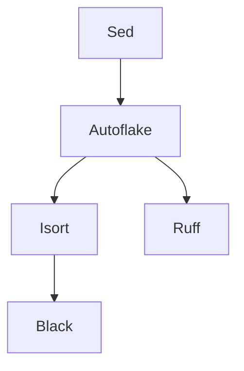

The Duolingo pre-commit hooks achieve high performance through intelligent parallel execution and dependency management. This page explains the internal architecture.

## System Overview

The hook system consists of three main components:

1. **Entry Point** (`entry.ts`) - TypeScript orchestrator that runs all hooks
2. **Hook Definitions** - Configuration for each formatter/linter
3. **Lock/Unlock Mechanism** - Dependency management for parallel execution

## Entry Point: entry.ts

The entry point is a Node.js script compiled from TypeScript that:

- Parses command-line arguments
- Filters files for each hook based on include/exclude patterns
- Executes hooks in parallel while respecting dependencies
- Collects and displays errors

Reference: `entry.ts:1-597`

## Hook Definition Structure

Each hook is defined with the following interface:

```typescript
interface Hook {
  action: (sources: string[], args: Args) => any;
  include: RegExp;
  exclude?: RegExp;
  runAfter?: HookName[];
}
```

### Fields

<Accordion title="action">
  A function that executes the formatter/linter on provided source files.
  
  **Returns:** Should throw an error string if violations are found that require manual fixes.
  
  **Formatters:** Only throw on parsing errors (malformed code)
  **Linters:** Throw on detected violations
  
  ```typescript
  action: sources => run(
    "prettier",
    "--write",
    ...PRETTIER_OPTIONS,
    ...sources
  )
  ```
  
  Reference: `entry.ts:118-119`
</Accordion>

<Accordion title="include">
  A regular expression that matches file paths to process.
  
  ```typescript
  include: /\.py$/  // Python files
  include: /\.[jt]sx?$/  // JS, JSX, TS, TSX
  include: /\.(cpp|proto$)/  // C++ and Protobuf
  ```
  
  Reference: `entry.ts:123`
</Accordion>

<Accordion title="exclude (optional)">
  A regular expression for files to skip, even if they match `include`.
  
  ```typescript
  exclude: /\bmin\b|\.(custom|pack)\./  // Minified JS files
  ```
  
  Reference: `entry.ts:121`
</Accordion>

<Accordion title="runAfter (optional)">
  Array of hook names that must complete before this hook starts.
  
  ```typescript
  runAfter: [HookName.Sed, HookName.EsLint]
  ```
  
  This creates a dependency graph for execution order.
  
  Reference: `entry.ts:125`
</Accordion>

## Parallel Execution with Dependencies

The hook system uses a sophisticated lock/unlock mechanism to run hooks in parallel while respecting dependencies.

### Lock/Unlock Mechanism

<Steps>
  <Step title="1. Create Lockable Hooks">
    Each hook is augmented with lock-related properties:
    
    ```typescript
    interface LockableHook extends Hook {
      lock: Promise<unknown>;         // Resolves when hook completes
      locksToWaitFor?: Promise<unknown>;  // Dependency locks
      unlock: () => void;             // Marks hook as complete
    }
    ```
    
    Reference: `entry.ts:537-544`
  </Step>

  <Step title="2. Initialize Locks">
    For each hook, create a Promise that will resolve when the hook completes:
    
    ```typescript
    let unlock = () => undefined as void;
    const lock = new Promise<void>(resolve => {
      unlock = resolve;
    });
    ```
    
    Reference: `entry.ts:547-550`
  </Step>

  <Step title="3. Set Up Dependencies">
    If a hook has `runAfter` dependencies, create a combined promise:
    
    ```typescript
    if (hook.runAfter) {
      hook.locksToWaitFor = Promise.all(
        hook.runAfter.map(hookName => lockableHooks[hookName].lock)
      );
    }
    ```
    
    This ensures the hook waits for all its dependencies to complete.
    
    Reference: `entry.ts:554-559`
  </Step>

  <Step title="4. Execute in Parallel">
    All hooks start simultaneously, but each waits for its dependencies:
    
    ```typescript
    await Promise.all(
      Object.entries(lockableHooks).map(async ([name, hook]) => {
        await hook.locksToWaitFor;  // Wait for dependencies
        await hook.action(includedSources, args);
        hook.unlock();  // Signal completion
      })
    );
    ```
    
    Reference: `entry.ts:564-592`
  </Step>
</Steps>

### Dependency Graph Example

Here's how hooks are ordered for Python files:



1. **Sed** runs first (trailing whitespace, empty collections)
2. **Autoflake** runs after Sed (remove unused imports)
3. **Isort** and **Ruff** run in parallel after Autoflake
4. **Black** runs after Isort completes

Reference: `entry.ts:130-293`

## File Filtering

Before running hooks, files are filtered through multiple stages:

### Global Excludes

```typescript
const GLOBAL_EXCLUDES = /(
  (^|/)(
    (.claude/skills/.generated|build|node_modules)/ |
    (AGENTS.md|copilot-instructions.md|gradlew)$
  )
)/x
```

These patterns are excluded from all hooks:
- Folders: `.claude/skills/.generated`, `build`, `node_modules`
- Files: `AGENTS.md`, `copilot-instructions.md`, `gradlew`

Reference: `entry.ts:485-495`

### Per-Hook Filtering

```typescript
const includedSources = sources.filter(
  source =>
    include.test(source) &&
    !GLOBAL_EXCLUDES.test(source) &&
    !(exclude && exclude.test(source))
);
```

For each hook:
1. File must match the `include` pattern
2. File must not match `GLOBAL_EXCLUDES`
3. File must not match the hook's `exclude` pattern (if any)

Reference: `entry.ts:571-576`

## Command Execution

The `run()` function executes shell commands safely:

```typescript
const run = (...args: string[]) =>
  new Promise<string>((resolve, reject) => {
    exec(
      args.map(arg => `'${arg.replace(/'/g, "'\"'\"'")}'`).join(" "),
      { maxBuffer: Infinity },
      (ex, stdout, stderr) => (ex ? reject : resolve)(stdout + stderr)
    );
  });
```

### Features

- **Argument escaping:** Handles single quotes in arguments using shell escaping
- **Unlimited output:** Sets `maxBuffer: Infinity` to handle large outputs
- **Combined streams:** Returns both stdout and stderr
- **Promise-based:** Integrates seamlessly with async/await

Reference: `entry.ts:39-46`

## Error Handling

### Formatter Errors vs Linter Errors

**Formatters** should only throw errors for parsing failures:

```typescript
// ESLint - swallow non-autofixable errors
try {
  await run("eslint", "--fix", "--config", "/eslint.config.js", ...sources);
} catch {
  // We only care about autofixable errors (now fixed)
}
```

Reference: `entry.ts:178-190`

**Linters** throw their violation output:

```typescript
// Most formatters just let run() throw on nonzero exit
action: sources => run("prettier", "--write", ...sources)
```

### Error Display

Errors are prefixed with the hook name for easy identification:

```typescript
const prefixLines = (prefix: string, lines: string) =>
  lines
    .split("\n")
    .filter(line => !LINES_TO_IGNORE.test(line))
    .map(line => `${prefix}:`.padEnd(maxPrefixLength + 2) + line)
    .join("\n");
```

Example output:
```
Prettier (JS):    Error: Could not parse file.js
ESLint:           'foo' is defined but never used
```

Reference: `entry.ts:497-520`, `entry.ts:584`

### Ignored Lines

Some tool outputs are suppressed to reduce noise:

```typescript
const LINES_TO_IGNORE = new RegExp([
  /^\s*$/,                              // Empty lines
  /\bDone formatting .+\.kts?$/,        // ktfmt success messages
  /\bDEPRECATION: Python 2 support\b/,  // Black Python 2 warning
]);
```

Reference: `entry.ts:499-510`

## File Transformations

The `transformFile()` function applies in-place modifications:

```typescript
const transformFile = (path: string, transform: (before: string) => string) =>
  new Promise<void>((resolve, reject) => {
    readFile(path, "utf8", (err, data) => {
      if (data === "") return resolve();  // Skip empty files
      
      const after = transform(data);
      if (data === after) return resolve();  // No changes
      
      writeFile(path, after, "utf8", err => ...);
    });
  });
```

### Optimizations

- **Skip empty files:** No transformation needed
- **Skip unchanged files:** Avoid unnecessary disk writes
- **Async I/O:** All file operations are asynchronous

Reference: `entry.ts:52-77`

## Special Cases

<Accordion title="ktfmt Memory Management">
  ktfmt can cause OOM errors with too many files. The hook processes files in batches:
  
  ```typescript
  const MAX_FILES_PER_PROCESS = 200;
  for (let i = 0; i < sources.length; i += MAX_FILES_PER_PROCESS) {
    await run(
      "java",
      "-Xmx256m",  // Cap memory at 256MB
      "-jar", "/ktfmt",
      ...sources.slice(i, i + MAX_FILES_PER_PROCESS)
    );
  }
  ```
  
  Reference: `entry.ts:228-244`
</Accordion>

<Accordion title="Ruff Multiple Passes">
  Ruff sometimes needs multiple passes to apply all fixes:
  
  ```typescript
  for (let i = 0; i < 2; ++i) {
    await run("ruff", "check", "--config", "/ruff.toml", ...sources);
    await run("ruff", "format", "--config", "/ruff.toml", ...sources);
  }
  ```
  
  Reference: `entry.ts:286-289`
</Accordion>

<Accordion title="Shell Script Detection">
  `shfmt` needs to identify shell scripts by extension or shebang:
  
  ```typescript
  // Check file extension
  if (/\.(bash|sh|zsh)$/.test(source)) return source;
  
  // Check shebang line
  const firstLine = await readFirstLine(source);
  if (/^#!.*\b(bash|sh|zsh)\b/.test(firstLine)) return source;
  ```
  
  Reference: `entry.ts:383-405`
</Accordion>

## Performance Characteristics

### Time Complexity

- **File filtering:** O(n × h) where n = files, h = hooks
- **Hook execution:** O(max dependency chain length) due to parallelization
- **Total time:** Dominated by slowest dependency chain, not total hooks

### Parallelization Benefits

Without dependencies, all hooks run simultaneously:

```
Sequential: Hook1 → Hook2 → Hook3 → Hook4 (40s total)
Parallel:   Hook1 ─┐
            Hook2 ─┼─ (10s total - time of slowest hook)
            Hook3 ─┤
            Hook4 ─┘
```

## Next Steps

<CardGroup cols={2}>
  <Card title="Docker Image" icon="docker" href="/advanced/docker-image">
    Understand the image structure
  </Card>
  <Card title="Troubleshooting" icon="wrench" href="/advanced/troubleshooting">
    Common issues and solutions
  </Card>
</CardGroup>