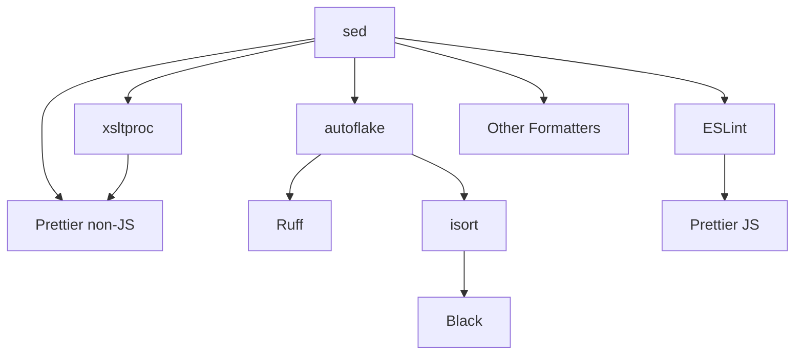

The `duolingo` hook is the main code formatting and linting tool that runs several formatters in parallel to maintain consistent code style across all languages used at Duolingo.

## Overview

This hook automatically formats and lints code files using language-specific tools. It runs all formatters in parallel for optimal performance and processes files based on their type and extension.

### Key Features

- **Parallel Execution** - All formatters run concurrently with dependency management
- **Multi-Language Support** - Supports 15+ programming languages
- **Auto-Fix Only** - Only enables rules that can be automatically fixed
- **Smart File Detection** - Uses regex patterns and shebangs to identify file types
- **Global Excludes** - Automatically excludes `build/` and `node_modules/` directories

## Supported Languages & Tools

The hook includes the following formatters and linters:

<Tabs>
  <Tab title="JavaScript/TypeScript">
    ### Prettier v3.5.3
    Formats JS, JSX, TypeScript, TSX files with these options:
    - Arrow parens: avoid
    - End of line: auto
    - Object wrap: collapse
    - Trailing comma: es5 (JS/JSX only)

    **Files**: `*.js`, `*.jsx`, `*.ts`, `*.tsx`

    ### ESLint v9.23.0
    Lints and auto-fixes JavaScript and TypeScript files.
    - Only auto-fixable rules enabled
    - Uses custom `/eslint.config.js`
    - Runs after sed transformations

    **Files**: `*.js`, `*.jsx`, `*.ts`, `*.tsx`

    **Excludes**: Minified files (matching `/\bmin\b|\.(custom|pack)\.`/)
  </Tab>

  <Tab title="Python">
    ### Ruff v0.7.3 (Python 3)
    Fast Python linter and formatter for Python 3.
    - Target version: Python 3.7+
    - Line length: 100
    - Fix-only mode enabled
    - Multiple passes for complex fixes

    **Configuration**: `/ruff.toml`

    ### Black v21.12b0 (Python 2)
    Python 2 code formatter.
    - Target version: Python 2.7
    - Line length: 100
    - Fast mode enabled

    **Only runs when**: `--python-version=2` is specified

    ### autoflake v1.7.8
    Removes unused imports and variables.
    - Ignores init module imports
    - Removes duplicate keys
    - Removes unused variables
    - Common libraries: attrs, boto, boto3, flask, pyramid, pytest, pytz, requests, simplejson, six

    ### isort v5.13.2 (Python 2)
    Sorts and organizes imports for Python 2.
    - Combine as imports: true
    - Uses `.editorconfig` settings

    **Only runs when**: `--python-version=2` is specified
  </Tab>

  <Tab title="Java/Kotlin">
    ### google-java-format v1.24.0
    Formats Java files according to Google Java Style.

    **Files**: `*.java`

    ### ktfmt v0.53
    Kotlin formatter with Google style.
    - Google style enabled
    - Max heap: 256m (to prevent OOM)
    - Batch processing: 200 files per process

    **Files**: `*.kt`, `*.kts`

    ### gradle-dependencies-sorter v0.14
    Sorts Gradle dependencies alphabetically.

    **Files**: `build.gradle.kts`

    **Note**: Groovy files (`build.gradle`) are skipped due to parsing issues with variables
  </Tab>

  <Tab title="Other Languages">
    ### Go
    **gofmt v1.23.3** - Official Go formatter
    - Simplify code: enabled (`-s`)
    - Files: `*.go`

    ### Scala
    **scalafmt v3.8.3** - Scala code formatter
    - Preset: IntelliJ
    - Docstrings oneline: fold
    - Docstrings wrap: no
    - Default dialect: Scala 2.12 (configurable)
    - Files: `*.scala`, `*.sbt`, `*.sc`

    ### Shell
    **shfmt v3.10.0** - Shell script formatter
    - Indent: 2 spaces
    - Binary operators at start of line
    - Indent switch cases
    - Simplify code
    - Space after redirect operators
    - Files: `*.sh`, `*.bash`, `*.zsh`, or files with shell shebang

    ### C++/Protobuf
    **ClangFormat v18.1.8** - C++ and Protobuf formatter
    - Uses `/.clang-format` config
    - Files: `*.cpp`, `*.proto`

    ### Infrastructure
    **terraform fmt v1.9.8** - Terraform formatter
    - Files: `*.tf`

    **packer fmt v1.14.2** - Packer template formatter
    - Files: `*.pkr.hcl`

    ### Web Assets
    **SVGO v3.3.2** - SVG optimizer
    - Files: `*.svg`

    **Prettier** - Also handles CSS, HTML, Markdown, Sass, XML, YAML
    - Files: `*.css`, `*.html`, `*.md`, `*.scss`, `*.xml`, `*.yaml`, `*.yml`

    ### Data Formats
    **Taplo v0.9.3** - TOML formatter
    - No auto-config
    - Align comments: false
    - Allowed blank lines: 1
    - Reorder keys: true
    - Files: `*.toml`

    **xsltproc** - XML formatter using XSLT stylesheet
    - Files: `*.xml`
  </Tab>

  <Tab title="Custom Transformations">
    ### sed (Regex Transformations)

    Custom regex-based transformations applied to all files:

    **Universal**:
    - Trim trailing whitespace
    - Strip beginning-of-file newlines
    - Ensure single end-of-file newline
    - Preserve line endings (CRLF or LF)

    **Kotlin** (`*.kt`):
    - `arrayOf()` → `emptyArray()`
    - `listOf()` → `emptyList()`
    - `mapOf()` → `emptyMap()`
    - `sequenceOf()` → `emptySequence()`
    - `setOf()` → `emptySet()`
    - Remove unnecessary `constructor` keyword

    **Python** (`*.py`):
    - `dict()` → `{}`
    - `list()` → `[]`
    - `tuple()` → `()`
    - `set([])` → `set()`
    - `frozenset([])` → `frozenset()`

    **Python 3 only**:
    - Remove `# -*- coding: utf-8 -*-` pragmas
    - Remove unnecessary `(object)` base class
  </Tab>
</Tabs>

## Configuration

Add the hook to your `.pre-commit-config.yaml`:

```yaml .pre-commit-config.yaml
repos:
  - repo: https://github.com/duolingo/pre-commit-hooks.git
    rev: 1.13.3
    hooks:
      - id: duolingo
```

### Command-Line Arguments

<ParamField path="--python-version" type="string" default="3">
  Specifies the Python version for your project. Set to `2` to enable Black and isort for Python 2.

  ```yaml
  - id: duolingo
    args:
      - --python-version=2
  ```
</ParamField>

<ParamField path="--scala-version" type="string" default="2.12">
  Specifies the Scala dialect version for scalafmt.

  ```yaml
  - id: duolingo
    args:
      - --scala-version=3
  ```
</ParamField>

### Complete Example

```yaml .pre-commit-config.yaml
repos:
  - repo: https://github.com/duolingo/pre-commit-hooks.git
    rev: 1.13.3
    hooks:
      - id: duolingo
        args:
          - --python-version=2
          - --scala-version=2.12
        exclude: ^vendor/  # Optional: additional exclusions
```

## Global Exclusions

The following paths are automatically excluded and don't need to be declared in the `exclude` key:

- `.claude/skills/.generated/`
- `build/`
- `node_modules/`
- `AGENTS.md` (generated by sync-ai-rules)
- `copilot-instructions.md` (generated by sync-ai-rules)
- `gradlew`

## Implementation Details

### Hook Execution Flow

1. **Parse Arguments** - Extract `--python-version` and `--scala-version` from args
2. **Filter Files** - Match files against include/exclude patterns
3. **Run Hooks in Parallel** - Execute formatters with dependency ordering:
   - `sed` runs first (no dependencies)
   - Most formatters run after `sed`
   - `isort` runs after `autoflake`
   - `Black` runs after `isort`
   - `Prettier (JS)` runs after `ESLint`
   - `Prettier (non-JS)` runs after `xsltproc` and `ESLint`
4. **Report Errors** - Display any parsing errors or unfixable violations

### Dependency Graph



### Source Code

The hook is implemented in `/entry.ts` (entry:1-597) as a Node.js script that:

- Runs as a Docker image: `duolingo/pre-commit-hooks:1.13.3`
- Accepts `types: [text]` from pre-commit
- Uses promise-based parallelization with lock/unlock mechanism
- Exits with code 1 if any formatter reports unfixable violations

## Editor Integration

To automatically format code in your IDE, copy or symlink the `.editorconfig` file from this repo to your home directory:

```bash
ln -s /path/to/pre-commit-hooks/.editorconfig ~/.editorconfig
```

Most [EditorConfig-compatible editors](https://editorconfig.org/) will automatically apply the same formatting rules used by this hook.

## Troubleshooting

<AccordionGroup>
  <Accordion title="Hook runs slowly">
    The hook runs formatters in parallel, so slow performance is usually due to:
    - Large number of files (narrow the scope with `files` or `exclude` patterns)
    - Docker image not cached (run `docker pull duolingo/pre-commit-hooks:1.13.3`)
    - Consider using `precache-docker` hook to speed up Docker image pulls
  </Accordion>

  <Accordion title="Formatter conflicts with my IDE">
    Make sure your IDE is using the same configuration:
    - Copy `.editorconfig` to your home directory
    - Disable conflicting IDE formatters
    - For ESLint: point to the same config file
    - For Prettier: match the CLI options in `entry.ts:17-36`
  </Accordion>

  <Accordion title="File not being formatted">
    Check if the file:
    - Matches an include pattern (see implementation details above)
    - Is not in a globally excluded directory (`build/`, `node_modules/`)
    - Is not matched by your custom `exclude` pattern
    - Is not a minified JS file (contains `min`, `.custom.`, or `.pack.`)
  </Accordion>

  <Accordion title="Python 2 formatters not running">
    Make sure you've added the argument:
    ```yaml
    - id: duolingo
      args:
        - --python-version=2
    ```
    Without this argument, only Ruff and autoflake will run (Python 3 mode).
  </Accordion>
</AccordionGroup>

<Note>
  This hook only enables rules whose violations can be fixed automatically. Rules requiring manual correction are disabled to minimize developer friction.
</Note>

<Warning>
  The hook modifies files in place. Always commit or stash your changes before running on a large codebase for the first time.
</Warning>
