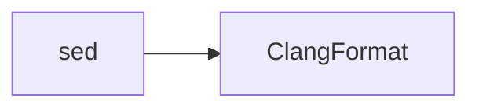

C++ and Protocol Buffer files are formatted with **ClangFormat**, the industry-standard C/C++ formatter.

## ClangFormat

LLVM's C/C++ formatter with extensive style customization.

### Version

- **clang-format**: 18 (linux-amd64)

### File Patterns

- `*.cpp` - C++ source files
- `*.proto` - Protocol Buffer definitions

## Configuration

ClangFormat uses Google's C++ style guide as defined in `.clang-format`:

```yaml
BasedOnStyle: Google

# Sorting includes is dangerous and can break compilation
SortIncludes: Never
```

### Style Base

**Google Style** includes:
- 2-space indentation
- Column limit of 80
- Pointer/reference alignment to the left
- Opening braces on same line for functions

Full Google style specification: https://google.github.io/styleguide/cppguide.html

### Custom Override

<Warning>
  **`SortIncludes: Never`** - Include sorting is disabled because:
  - Order of includes can affect compilation
  - System headers may need to be included before/after specific headers
  - Sorting can break code that relies on macro definitions from earlier includes
</Warning>

## Command Line

ClangFormat is invoked with:

```bash
/clang-format \
  -i \
  --style=file:/.clang-format
```

### CLI Options

<Tabs>
  <Tab title="-i (in-place)">
    Edit files in-place instead of outputting to stdout.
    
    ```bash
    clang-format -i file.cpp  # Modifies file.cpp directly
    ```
  </Tab>
  <Tab title="--style=file">
    Load style configuration from `.clang-format` file.
    
    ```bash
    --style=file:/.clang-format  # Use config at specified path
    ```
  </Tab>
</Tabs>

## Implementation

From entry.ts:166-176:

```typescript
[HookName.ClangFormat]: {
  action: sources =>
    run(
      "/clang-format",
      "-i",
      "--style=file:/.clang-format",
      ...sources,
    ),
  include: /\.(cpp|proto$)/,
  runAfter: [HookName.Sed],
},
```

## Execution Order

ClangFormat runs after `sed` transformations:



## Installation

ClangFormat is installed as a static binary from clang-tools-static-binaries (Dockerfile:92-93):

```dockerfile
wget https://github.com/muttleyxd/clang-tools-static-binaries/releases/download/master-32d3ac78/clang-format-18_linux-amd64 -O clang-format
chmod +x clang-format
```

<Info>
  Static binaries are used to avoid C++ runtime dependencies and reduce image size.
</Info>

## Example Transformations

<Tabs>
  <Tab title="C++ - Indentation">
    ```cpp
    // Before
    int main() {
    if (condition) {
    doSomething();
    }
    return 0;
    }
    
    // After
    int main() {
      if (condition) {
        doSomething();
      }
      return 0;
    }
    ```
  </Tab>
  <Tab title="C++ - Pointer Alignment">
    ```cpp
    // Before
    int *ptr;
    std::string &ref;
    const char *const *argv;
    
    // After (Google style)
    int* ptr;
    std::string& ref;
    const char* const* argv;
    ```
    
    Pointers and references align to the left (with the type).
  </Tab>
  <Tab title="C++ - Braces">
    ```cpp
    // Before
    void function()
    {
      // code
    }
    
    // After (Google style)
    void function() {
      // code
    }
    ```
  </Tab>
  <Tab title="C++ - Line Breaks">
    ```cpp
    // Before
    void longFunctionName(int param1, int param2, int param3, int param4, int param5, int param6) {
      // Too long for 80 columns
    }
    
    // After
    void longFunctionName(int param1, int param2, int param3, int param4,
                          int param5, int param6) {
      // Wrapped to fit within column limit
    }
    ```
  </Tab>
  <Tab title="Protobuf - Basic">
    ```protobuf
    // Before
    message Person {
    string name = 1;
    int32 age = 2;
    repeated string emails = 3;
    }
    
    // After
    message Person {
      string name = 1;
      int32 age = 2;
      repeated string emails = 3;
    }
    ```
  </Tab>
  <Tab title="Protobuf - Nested">
    ```protobuf
    // Before
    message Company {
    string name = 1;
    message Employee {
    string name = 1;
    int32 id = 2;
    }
    repeated Employee employees = 2;
    }
    
    // After
    message Company {
      string name = 1;
      message Employee {
        string name = 1;
        int32 id = 2;
      }
      repeated Employee employees = 2;
    }
    ```
  </Tab>
</Tabs>

## Google C++ Style Highlights

Key formatting rules from the Google style:

### Indentation
- 2 spaces (no tabs)
- Continued lines indented 4 spaces

### Column Limit
- 80 characters per line
- Automatic wrapping for long statements

### Braces
- Opening brace on same line as declaration
- Exception: Empty functions can be `{}`

### Spacing
- Space after control keywords (`if`, `for`, `while`)
- No space between function name and `(`
- Space around binary operators

### Pointers and References
- `*` and `&` attached to type, not variable
- `int* ptr` not `int *ptr`

## Protobuf Specifics

ClangFormat works well with Protocol Buffer syntax:

### Field Alignment

Fields are not aligned by field number (this is intentional):

```protobuf
// ClangFormat output
message Example {
  string short = 1;
  int32 id = 2;
  string very_long_field_name = 3;
}
```

### Comments

Both `//` and `/* */` comments are preserved and indented:

```protobuf
message Example {
  // Single-line comment
  string field = 1;
  
  /* Multi-line
     comment */
  int32 other = 2;
}
```

## Why ClangFormat?

ClangFormat is the de facto standard for C++ formatting:

- **Industry standard**: Used by Google, LLVM, Chromium, and many others
- **Comprehensive**: Handles complex C++ syntax correctly
- **Configurable**: Extensive style options
- **Fast**: Written in C++, processes large files quickly
- **Protobuf support**: Also formats `.proto` files correctly

<Note>
  While include sorting is powerful, it's disabled here (`SortIncludes: Never`) to prevent compilation issues. Teams that want this feature should enable it carefully after verifying their codebase.
</Note>
