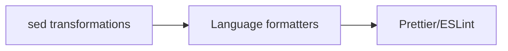

Custom **sed-like transformations** run before all other formatters, applying regex-based code improvements that aren't provided by standard tools.

## Overview

The `sed` hook applies regex transformations to enforce coding standards and best practices. It runs **first** in the hook chain, allowing formatters to work with already-improved code.

### Execution Order



## Universal Transformations

These transformations apply to **all file types** (entry.ts:327-332):

### Whitespace Cleanup

```typescript
// Strip trailing whitespace, strip BOF newlines, require single EOF newline
const eol = /\r/.test(data) ? "\r\n" : "\n";
data = data
  .replace(/[^\S\r\n]+$/gm, "")  // Remove trailing whitespace
  .replace(/^[\r\n]+|\s+$/g, "") // Remove BOF newlines and EOF whitespace
  + eol;                          // Add single EOF newline
```

<Tabs>
  <Tab title="Trailing Whitespace">
    ```python
    # Before
    def hello():    
        print("world")  
    
    # After
    def hello():
        print("world")
    ```
  </Tab>
  <Tab title="EOF Newline">
    ```javascript
    // Before (no newline at end)
    console.log("hello");
    
    // After (exactly one newline)
    console.log("hello");
    ↵
    ```
  </Tab>
  <Tab title="BOF Newlines">
    ```python
    # Before
    ↵
    ↵
    import os
    
    # After
    import os
    ```
  </Tab>
</Tabs>

### Line Ending Detection

Automatically detects and preserves line endings:
- **CRLF** (`\r\n`) on Windows files
- **LF** (`\n`) on Unix files

## Kotlin Transformations

Applied to `*.kt` files (entry.ts:334-348):

### Empty Collection Singletons

Replace empty immutable collections with singleton functions to avoid unnecessary allocations:

```typescript
data = data
  .replace(/\barrayOf\(\)/g, "emptyArray()")
  .replace(/\blistOf\(\)/g, "emptyList()")
  .replace(/\bmapOf\(\)/g, "emptyMap()")
  .replace(/\bsequenceOf\(\)/g, "emptySequence()")
  .replace(/\bsetOf\(\)/g, "emptySet()");
```

<Tabs>
  <Tab title="Arrays">
    ```kotlin
    // Before
    val empty = arrayOf()
    
    // After
    val empty = emptyArray()
    ```
  </Tab>
  <Tab title="Lists">
    ```kotlin
    // Before
    val items = listOf()
    
    // After
    val items = emptyList()
    ```
  </Tab>
  <Tab title="Maps">
    ```kotlin
    // Before
    val lookup = mapOf()
    
    // After
    val lookup = emptyMap()
    ```
  </Tab>
  <Tab title="Sequences">
    ```kotlin
    // Before
    val seq = sequenceOf()
    
    // After
    val seq = emptySequence()
    ```
  </Tab>
  <Tab title="Sets">
    ```kotlin
    // Before
    val unique = setOf()
    
    // After
    val unique = emptySet()
    ```
  </Tab>
</Tabs>

<Info>
  **Why this matters**: Empty collections are immutable, so using singleton instances (like Python's empty tuple `()`) avoids unnecessary allocations.
</Info>

### Remove Unnecessary Constructor Keyword

```typescript
data = data.replace(/(?<=\bclass \S+) constructor(?=\()/g, "");
```

```kotlin
// Before
class Person constructor(val name: String)

// After
class Person(val name: String)
```

The `constructor` keyword is optional when not using annotations or visibility modifiers.

## Python Transformations

Applied to `*.py` files (entry.ts:350-371):

### Empty Collection Literals

Prefer empty collection literals for simplicity:

```typescript
data = data.replace(/(?<=^|[ ([{=])dict\(\)/gm, "{}");
data = data.replace(/(?<=^|[ ([{=])list\(\)/gm, "[]");
data = data.replace(/(?<=^|[ ([{=])tuple\(\)/gm, "()");
```

<Tabs>
  <Tab title="Dictionaries">
    ```python
    # Before
    config = dict()
    x = [dict(), dict()]
    
    # After
    config = {}
    x = [{}, {}]
    ```
  </Tab>
  <Tab title="Lists">
    ```python
    # Before
    items = list()
    nested = [list(), list()]
    
    # After
    items = []
    nested = [[], []]
    ```
  </Tab>
  <Tab title="Tuples">
    ```python
    # Before
    point = tuple()
    
    # After
    point = ()
    ```
  </Tab>
</Tabs>

### Simplify Set Construction

Remove unnecessary `[]` from empty sets:

```typescript
data = data.replace(
  /(?<=(?:^|[ ([{=])(?:frozen)?set\()\[\](?=\))/gm,
  "",
);
```

```python
# Before
my_set = set([])
frozen = frozenset([])

# After
my_set = set()
frozen = frozenset()
```

### Python 3 Only Transformations

These only apply when **NOT** using `--python-version=2.x` (entry.ts:363-370):

<Tabs>
  <Tab title="Remove UTF-8 Declarations">
    ```python
    # Before
    # -*- coding: utf-8 -*-
    import os
    
    # After
    import os
    ```
    
    ```typescript
    data = data.replace(/^# -\*- coding: utf-?8.*?\n/gim, "");
    ```
    
    UTF-8 is the default encoding in Python 3.
  </Tab>
  <Tab title="Remove object Base Class">
    ```python
    # Before
    class MyClass(object):
        pass
    
    # After
    class MyClass:
        pass
    ```
    
    ```typescript
    data = data.replace(/(?<=^ *class \S+?)\(object\)(?=:)/gm, "");
    ```
    
    All classes inherit from `object` by default in Python 3.
  </Tab>
</Tabs>

## Implementation

From entry.ts:322-378:

```typescript
[HookName.Sed]: {
  action: (sources, args) =>
    Promise.all(
      sources.map(source =>
        transformFile(source, data => {
          // Universal transformations
          const eol = /\r/.test(data) ? "\r\n" : "\n";
          data = data
            .replace(/[^\S\r\n]+$/gm, "")
            .replace(/^[\r\n]+|\s+$/g, "") + eol;

          // Kotlin transformations
          if (source.endsWith(".kt")) {
            // ...
          }

          // Python transformations
          if (source.endsWith(".py")) {
            // ...
          }

          return data;
        }),
      ),
    ),
  include: /./,  // Match all files
},
```

### File Pattern

```typescript
include: /./  // Matches all files
```

The sed hook processes **all files**, but language-specific transformations only apply to relevant extensions.

## Safety Guidelines

Before adding new transformations, ensure they are:

1. **Safe**: Won't break valid code
2. **Needed**: Empirically verified to apply to existing violations

From entry.ts:318-321:

> Before proposing a new transformation, please make sure that it's both (1) safe and (2) likely to ever actually be needed. At Duolingo, we determine the latter criterion empirically by seeing how many existing violations our codebase contains.

## Performance

The `transformFile` helper (entry.ts:52-77) optimizes for performance:

```typescript
const transformFile = (path: string, transform: (before: string) => string) => {
  readFile(path, "utf8", (err, data) => {
    // File empty - skip
    if (data === "") {
      resolve();
      return;
    }

    // File unmodified - skip write
    const after = transform(data);
    if (data === after) {
      resolve();
      return;
    }

    // File modified - write
    writeFile(path, after, "utf8", ...);
  });
};
```

<Info>
  Files are only written if content actually changed, minimizing disk I/O.
</Info>

## Examples by Language

<Tabs>
  <Tab title="Kotlin">
    ```kotlin
    // Before
    class User constructor(val name: String) {
        val tags = listOf()
        val metadata = mapOf()
        val ids = setOf()
    }
    
    // After
    class User(val name: String) {
        val tags = emptyList()
        val metadata = emptyMap()
        val ids = emptySet()
    }
    ```
  </Tab>
  <Tab title="Python 2">
    ```python
    # Before
    # -*- coding: utf-8 -*-
    
    class MyClass(object):
        def __init__(self):
            self.items = list()
            self.config = dict()
    
    # After (Python 2 keeps object)
    # -*- coding: utf-8 -*-
    
    class MyClass(object):
        def __init__(self):
            self.items = []
            self.config = {}
    ```
  </Tab>
  <Tab title="Python 3">
    ```python
    # Before
    # -*- coding: utf-8 -*-
    
    class MyClass(object):
        def __init__(self):
            self.items = list()
            self.config = dict()
    
    # After (Python 3 removes both)
    class MyClass:
        def __init__(self):
            self.items = []
            self.config = {}
    ```
  </Tab>
  <Tab title="All Files">
    ```javascript
    // Before (trailing whitespace and multiple EOF newlines)
    function hello() {  
        return "world";  
    }  
    ↵
    ↵
    ↵
    
    // After (clean)
    function hello() {
        return "world";
    }
    ↵
    ```
  </Tab>
</Tabs>

## Why "sed"?

The hook is named after the Unix `sed` (stream editor) command, which performs text transformations using regular expressions. Like `sed`, this hook:

- Applies regex-based transformations
- Processes files in-place
- Runs transformations in a defined order
- Is fast and efficient

<Note>
  Despite the name, the implementation uses JavaScript string methods, not the actual `sed` command.
</Note>
