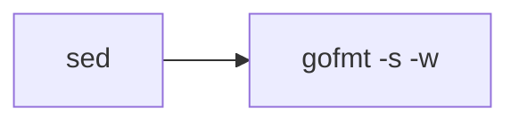

Go files are formatted with **gofmt**, the official Go formatter, with additional simplification enabled.

## gofmt

The standard Go formatting tool, included with every Go installation.

### Version

- **Go**: 1.23.3
- **gofmt**: Bundled with Go 1.23.3

### File Pattern

- `*.go` - Go source files

## Configuration

gofmt is invoked with simplification and write flags:

```bash
/gofmt -s -w
```

### CLI Options

<Tabs>
  <Tab title="-s (simplify)">
    Applies simplification rules to the code:
    
    - Removes unnecessary composite literal types
    - Simplifies slice expressions
    - Simplifies range loops
    
    This is the most important flag and provides additional cleanup beyond formatting.
  </Tab>
  <Tab title="-w (write)">
    Writes the formatted output back to the original file instead of stdout.
  </Tab>
</Tabs>

## Implementation

From entry.ts:196-200:

```typescript
[HookName.Gofmt]: {
  action: sources => run("/gofmt", "-s", "-w", ...sources),
  include: /\.go$/,
  runAfter: [HookName.Sed],
},
```

## Execution Order

gofmt runs after `sed` transformations:



## Binary Source

The gofmt binary is copied from the official Go Docker image (Dockerfile:126):

```dockerfile
COPY --from=golang:1.23.3-alpine3.20 /usr/local/go/bin/gofmt /gofmt
```

<Info>
  Using the official Go image ensures compatibility and authenticity of the gofmt binary.
</Info>

## Example Transformations

<Tabs>
  <Tab title="Indentation & Spacing">
    ```go
    // Before
    func main(){
        fmt.Println("Hello, World!")
    }
    
    // After
    func main() {
    	fmt.Println("Hello, World!")
    }
    ```
    
    Note: gofmt uses **tabs** for indentation, not spaces.
  </Tab>
  <Tab title="Simplify Composite Literals">
    ```go
    // Before
    var x = []int{1, 2, 3}
    y := []int{int(1), int(2), int(3)}
    z := map[string]int{string("a"): 1}
    
    // After
    var x = []int{1, 2, 3}
    y := []int{1, 2, 3}
    z := map[string]int{"a": 1}
    ```
    
    The `-s` flag removes unnecessary type conversions in composite literals.
  </Tab>
  <Tab title="Simplify Slice Expressions">
    ```go
    // Before
    s := arr[0:len(arr)]
    t := arr[0:]
    
    // After
    s := arr[:]
    t := arr[:]
    ```
  </Tab>
  <Tab title="Simplify Range Loops">
    ```go
    // Before
    for i, _ := range items {
        process(i)
    }
    
    for _, v := range items {
        process(v)
    }
    
    // After
    for i := range items {
        process(i)
    }
    
    for _, v := range items {
        process(v)
    }
    ```
    
    Blank identifiers are removed when not needed.
  </Tab>
  <Tab title="Struct Formatting">
    ```go
    // Before
    type Config struct {
    Host string
    Port int
    Timeout time.Duration
    }
    
    // After
    type Config struct {
    	Host    string
    	Port    int
    	Timeout time.Duration
    }
    ```
    
    Field declarations are aligned for readability.
  </Tab>
</Tabs>

## Why gofmt?

gofmt is the de facto standard for Go code formatting:

- **Universal adoption**: Nearly all Go code is formatted with gofmt
- **No configuration needed**: One true style eliminates bikeshedding
- **Fast**: Written in Go, processes files quickly
- **Built-in**: Ships with every Go installation

<Note>
  The Go community strongly encourages using gofmt without customization. This hook respects that philosophy by using only the standard `-s` flag.
</Note>

## Alternatives Not Used

### goimports

Not included because:
- Requires understanding of the Go module system
- Can be slow on large codebases
- Import management is better handled by IDEs during development

### gofumpt

Not included because:
- Adds opinionated rules beyond standard gofmt
- Not universally accepted in the Go community
- Standard gofmt provides sufficient consistency
