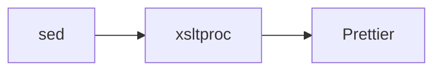

Markup and data format files are formatted with specialized tools: **SVGO** for SVG optimization, **Taplo** for TOML formatting, and **xsltproc** for XML attribute sorting.

## SVGO (SVG Optimizer)

Node.js-based SVG optimization tool that cleans up SVG files.

### Version

- **SVGO**: 3.3.2

### File Pattern

- `*.svg` - Scalable Vector Graphics files

### Configuration

Defined in `svgo.config.js`:

```javascript
module.exports = {
  plugins: ["cleanupAttrs", "removeComments"],
  quiet: true
};
```

### Enabled Plugins

<Tabs>
  <Tab title="cleanupAttrs">
    Cleans up attributes in SVG elements:
    - Removes unnecessary whitespace in attribute values
    - Normalizes attribute formatting
    - Removes default values
    
    ```xml
    <!-- Before -->
    <rect width="  100  " height="50" />
    
    <!-- After -->
    <rect width="100" height="50"/>
    ```
  </Tab>
  <Tab title="removeComments">
    Strips all comments from SVG files:
    
    ```xml
    <!-- Before -->
    <!-- This is a comment -->
    <svg>
      <!-- Another comment -->
      <rect/>
    </svg>
    
    <!-- After -->
    <svg>
      <rect/>
    </svg>
    ```
  </Tab>
</Tabs>

### Disabled Optimizations

Many SVGO plugins are **not** enabled to avoid breaking changes:

- **Not** removing viewBox (needed for scaling)
- **Not** merging paths (can break animations)
- **Not** removing IDs (needed for references)
- **Not** minifying styles (keeps CSS readable)

<Info>
  The configuration is intentionally conservative, focusing on safe, non-breaking cleanups.
</Info>

### Command Line

```bash
svgo --config /svgo.config.js
```

### Implementation

From entry.ts:430-434:

```typescript
[HookName.Svgo]: {
  action: sources => run("svgo", "--config", "/svgo.config.js", ...sources),
  include: /\.svg$/,
  runAfter: [HookName.Sed],
},
```

## Taplo (TOML Formatter)

A fast TOML formatter and toolkit written in Rust.

### Version

- **Taplo**: 0.9.3

### File Pattern

- `*.toml` - TOML configuration files

### Configuration

All options passed via CLI (no config file):

```bash
/taplo format \
  --colors never \
  --no-auto-config \
  --option align_comments=false \
  --option allowed_blank_lines=1 \
  --option reorder_keys=true
```

### Formatter Options

<Tabs>
  <Tab title="align_comments=false">
    Don't align comments to a specific column:
    
    ```toml
    # With align_comments=false
    short = "value" # Comment
    very_long_key = "value" # Another comment
    
    # With align_comments=true (not used)
    short = "value"         # Comment
    very_long_key = "value" # Another comment
    ```
    
    <Note>
      Disabled to avoid unnecessary diff churn when keys change.
    </Note>
  </Tab>
  <Tab title="allowed_blank_lines=1">
    Allow maximum of 1 blank line between sections:
    
    ```toml
    [section1]
    key = "value"
    
    [section2]  # Only 1 blank line allowed above
    key = "value"
    ```
    
    Matches style used in other languages (except Python which allows 2).
  </Tab>
  <Tab title="reorder_keys=true">
    Sort keys alphabetically within sections:
    
    ```toml
    # Before
    [section]
    zebra = 1
    apple = 2
    middle = 3
    
    # After
    [section]
    apple = 2
    middle = 3
    zebra = 1
    ```
    
    Maximizes consistency and reduces merge conflicts.
  </Tab>
</Tabs>

### CLI Flags

- `--colors never`: No ANSI color codes (for CI environments)
- `--no-auto-config`: Don't search for config files (use CLI options only)

### Implementation

From entry.ts:435-454:

```typescript
[HookName.Taplo]: {
  action: sources =>
    run(
      "/taplo",
      "format",
      "--colors", "never",
      "--no-auto-config",
      "--option", "align_comments=false",
      "--option", "allowed_blank_lines=1",
      "--option", "reorder_keys=true",
      ...sources,
    ),
  include: /\.toml$/,
  runAfter: [HookName.Sed],
},
```

### Installation

Installed as a compressed static binary (Dockerfile:99-101):

```dockerfile
wget https://github.com/tamasfe/taplo/releases/download/0.9.3/taplo-linux-x86_64.gz -O taplo.gz
gzip -d taplo.gz
chmod +x taplo
```

## xsltproc (XML Transformer)

XSLT processor that sorts XML attributes alphabetically.

### Version

- **libxslt** (includes xsltproc): Alpine package version

### File Pattern

- `*.xml` - XML files

### Configuration

Uses a custom XSLT stylesheet (`stylesheet.xml`) to transform XML:

```xml
<?xml version="1.0" encoding="utf-8" ?>
<xsl:stylesheet
  xmlns:xsl="http://www.w3.org/1999/XSL/Transform"
  xmlns:android="http://schemas.android.com/apk/res/android"
  version="1.0"
>
  <!-- Indent output -->
  <xsl:strip-space elements="*" />
  <xsl:output encoding="utf-8" indent="yes" method="xml" />
  
  <!-- Document root -->
  <xsl:template match="/">
    <xsl:apply-templates />
  </xsl:template>
  
  <!-- Sort non-text nodes' attributes -->
  <xsl:template match="*">
    <xsl:copy>
      <xsl:for-each select="@*">
        <xsl:sort select="name(.)" />
        <xsl:copy />
      </xsl:for-each>
      <xsl:apply-templates />
    </xsl:copy>
  </xsl:template>
  
  <!-- Leave text nodes untouched -->
  <xsl:template match="text()|comment()|processing-instruction()">
    <xsl:copy />
  </xsl:template>
</xsl:stylesheet>
```

### What It Does

1. **Sorts attributes alphabetically** on all elements
2. **Indents output** for readability
3. **Preserves text, comments, and processing instructions**
4. **Uses UTF-8 encoding**

### Command Line

```bash
xsltproc --output <file> /stylesheet.xml <file>
```

The file is both input and output (in-place transformation).

### Implementation

From entry.ts:472-481:

```typescript
[HookName.Xsltproc]: {
  action: sources =>
    Promise.all(
      sources.map(source =>
        run("xsltproc", "--output", source, "/stylesheet.xml", source),
      ),
    ),
  include: /\.xml$/,
  runAfter: [HookName.Sed],
},
```

### Execution Order

xsltproc runs **before** Prettier:



<Info>
  XML files get processed by both xsltproc (attribute sorting) and Prettier (formatting).
</Info>

## Example Transformations

<Tabs>
  <Tab title="SVG - cleanupAttrs">
    ```xml
    <!-- Before -->
    <svg width="  100  " height="  50  ">
      <rect x="0" y="0" width="100" height="50" fill="  red  "/>
    </svg>
    
    <!-- After -->
    <svg width="100" height="50">
      <rect x="0" y="0" width="100" height="50" fill="red"/>
    </svg>
    ```
  </Tab>
  <Tab title="SVG - removeComments">
    ```xml
    <!-- Before -->
    <svg>
      <!-- Generated by Adobe Illustrator -->
      <g id="layer1">
        <!-- Circle shape -->
        <circle cx="50" cy="50" r="40"/>
      </g>
    </svg>
    
    <!-- After -->
    <svg>
      <g id="layer1">
        <circle cx="50" cy="50" r="40"/>
      </g>
    </svg>
    ```
  </Tab>
  <Tab title="TOML - Reorder Keys">
    ```toml
    # Before
    [package]
    version = "1.0.0"
    name = "my-app"
    authors = ["Alice"]
    edition = "2021"
    
    # After
    [package]
    authors = ["Alice"]
    edition = "2021"
    name = "my-app"
    version = "1.0.0"
    ```
  </Tab>
  <Tab title="TOML - Blank Lines">
    ```toml
    # Before
    [section1]
    key = "value"
    
    
    
    [section2]
    key = "value"
    
    # After (max 1 blank line)
    [section1]
    key = "value"
    
    [section2]
    key = "value"
    ```
  </Tab>
  <Tab title="XML - Attribute Sorting">
    ```xml
    <!-- Before -->
    <View
      android:layout_height="wrap_content"
      android:id="@+id/myView"
      android:layout_width="match_parent"
      android:background="#FFFFFF"
    />
    
    <!-- After -->
    <View
      android:background="#FFFFFF"
      android:id="@+id/myView"
      android:layout_height="wrap_content"
      android:layout_width="match_parent"
    />
    ```
  </Tab>
  <Tab title="XML - Preserve Content">
    ```xml
    <!-- Before -->
    <root attr2="b" attr1="a">
      <child>Text content</child>
      <!-- Comment preserved -->
      <?processing instruction?>
    </root>
    
    <!-- After -->
    <root attr1="a" attr2="b">
      <child>Text content</child>
      <!-- Comment preserved -->
      <?processing instruction?>
    </root>
    ```
  </Tab>
</Tabs>

## Tool Comparison

| Tool | Format | Purpose | Key Feature |
|------|--------|---------|-------------|
| SVGO | SVG | Optimize | Remove cruft, clean attributes |
| Taplo | TOML | Format | Sort keys, consistent spacing |
| xsltproc | XML | Transform | Sort attributes alphabetically |

## Why These Tools?

### SVGO
- **Most popular**: De facto standard for SVG optimization
- **Configurable**: Can enable/disable specific optimizations
- **Node.js**: Easy to integrate with existing tooling

### Taplo
- **Fast**: Written in Rust
- **Modern**: Supports latest TOML spec
- **Flexible**: Rich CLI options without config files

### xsltproc
- **Universal**: Available on all Unix systems
- **Powerful**: Full XSLT transformation capabilities
- **Custom logic**: Stylesheet can implement any XML transformation

<Note>
  XML files are processed by **both** xsltproc and Prettier to combine attribute sorting with consistent formatting.
</Note>
