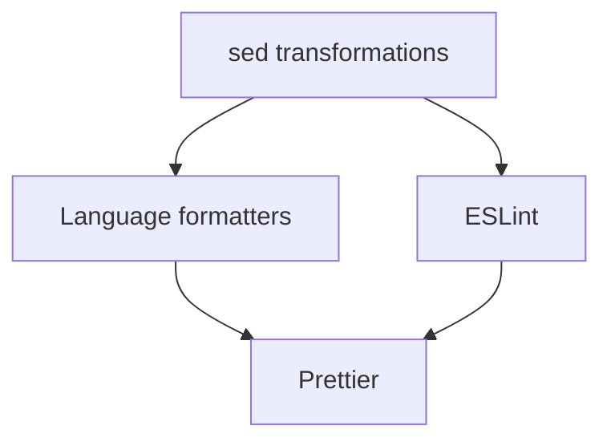

Duolingo Pre-commit Hooks packages 20 different formatters and linters into a single Docker image, supporting 10+ programming languages and file formats.

## Language Support

All tools are pre-configured with sensible defaults and run automatically based on file extensions.

<CardGroup cols={2}>
  <Card title="JavaScript & TypeScript" icon="js" href="/tools/javascript-typescript">
    Prettier and ESLint with modern plugins
  </Card>
  <Card title="Python" icon="python" href="/tools/python">
    Ruff, Black, autoflake, and isort
  </Card>
  <Card title="Java & Kotlin" icon="java" href="/tools/java-kotlin">
    google-java-format, ktfmt, gradle-dependencies-sorter
  </Card>
  <Card title="Scala" icon="code" href="/tools/scala">
    scalafmt with IntelliJ preset
  </Card>
  <Card title="Go" icon="golang" href="/tools/go">
    gofmt with simplification
  </Card>
  <Card title="Shell" icon="terminal" href="/tools/shell">
    shfmt with consistent formatting
  </Card>
  <Card title="Terraform & Packer" icon="cloud" href="/tools/terraform-packer">
    terraform fmt and packer fmt
  </Card>
  <Card title="C++ & Protobuf" icon="code" href="/tools/cpp-protobuf">
    ClangFormat with Google style
  </Card>
  <Card title="Markup & Data" icon="file-code" href="/tools/markup-data">
    SVGO, Taplo, xsltproc for SVG/TOML/XML
  </Card>
  <Card title="Custom Transformations" icon="wand-magic-sparkles" href="/tools/custom-transformations">
    Regex-based code improvements
  </Card>
</CardGroup>

## Tool Execution

### Parallel Processing

All tools run in parallel when possible, with dependency ordering handled automatically:

### Dependency Chain

Most formatters run after `sed` transformations to ensure custom rules are applied first. ESLint runs before Prettier to avoid conflicts.

## File Pattern Matching

Tools automatically detect applicable files based on extensions:

| Pattern | Tools |
|---------|-------|
| `*.js`, `*.jsx` | ESLint, Prettier |
| `*.ts`, `*.tsx` | ESLint, Prettier |
| `*.py` | Ruff, Black, autoflake, isort |
| `*.java` | google-java-format |
| `*.kt`, `*.kts` | ktfmt |
| `*.scala`, `*.sbt`, `*.sc` | scalafmt |
| `*.go` | gofmt |
| `*.sh`, `*.bash`, `*.zsh` | shfmt |
| `*.tf` | terraform fmt |
| `*.pkr.hcl` | packer fmt |
| `*.cpp`, `*.proto` | ClangFormat |
| `*.svg` | SVGO |
| `*.toml` | Taplo |
| `*.xml` | xsltproc |

## Global Exclusions

The following files and directories are automatically excluded:

- `node_modules/`
- `build/`
- `.claude/skills/.generated/`
- `gradlew`
- Minified JavaScript files (containing `min` or `.custom.` or `.pack.` in filename)

## Version Information

All tools are pinned to specific versions for reproducibility. See individual tool pages for version details.

<Info>
  Tool versions are defined in the `Dockerfile` and updated regularly to include the latest stable releases.
</Info>
