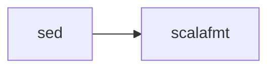

Scala files are formatted with **scalafmt** using the IntelliJ preset and dynamic configuration.

## scalafmt

The official Scala code formatter with flexible configuration.

### Version

- **scalafmt**: 3.8.3
- **Scala version**: 2.13 (for scalafmt binary itself)

### File Patterns

- `*.scala` - Scala source files
- `*.sbt` - SBT build files
- `*.sc` - Scala script files

## Configuration

scalafmt is configured dynamically via `--config-str` rather than a config file (entry.ts:294-314):

```typescript
{
  "docstrings.oneline": "fold",
  "docstrings.wrap": "no",
  preset: "IntelliJ",
  "runner.dialect": `scala${(args["scala-version"] ?? "2.12")
    .split(".")
    .slice(0, 2)
    .join("")}`,
  version: (await run("/scalafmt", "--version")).split(" ")[1],
}
```

### Configuration Options

<Tabs>
  <Tab title="Preset">
    ```javascript
    preset: "IntelliJ"
    ```
    
    Uses IntelliJ IDEA's Scala style guide as the base configuration.
  </Tab>
  <Tab title="Docstrings">
    ```javascript
    "docstrings.oneline": "fold",
    "docstrings.wrap": "no"
    ```
    
    - **oneline**: Fold single-line docstrings
    - **wrap**: Don't wrap long docstrings
  </Tab>
  <Tab title="Scala Dialect">
    ```javascript
    "runner.dialect": "scala212"  // or scala213, scala3, etc.
    ```
    
    Automatically determined from `--scala-version` argument.
  </Tab>
  <Tab title="Version">
    ```javascript
    version: "3.8.3"
    ```
    
    Dynamically detected from scalafmt itself to ensure config compatibility.
  </Tab>
</Tabs>

## Version Configuration

The Scala dialect version is configurable via hook arguments:

```yaml
# .pre-commit-config.yaml
- repo: https://github.com/duolingo/pre-commit-hooks
  hooks:
    - id: duolingo
      args: [--scala-version=2.13]
```

### Default Version

If not specified, defaults to **Scala 2.12**:

```typescript
args["scala-version"] ?? "2.12"
```

### Version Parsing

Only major.minor version is used:

```typescript
.split(".")
.slice(0, 2)
.join("")  // "2.13.10" → "213" → "scala213"
```

## Command Line

Full command executed:

```bash
/scalafmt \
  --config-str "docstrings.oneline=fold,docstrings.wrap=no,preset=IntelliJ,runner.dialect=scala212,version=3.8.3" \
  --non-interactive \
  --quiet
```

### CLI Options

- `--config-str`: Inline configuration (avoids need for `.scalafmt.conf`)
- `--non-interactive`: No prompts in CI/pre-commit environments
- `--quiet`: Suppress progress output

## Installation

scalafmt is installed via Coursier (entry.ts:83-89, Dockerfile:83-89):

```dockerfile
wget https://github.com/coursier/coursier/releases/download/v2.1.17/coursier
coursier bootstrap org.scalameta:scalafmt-cli_2.13:3.8.3 \
  -r sonatype:snapshots \
  --main org.scalafmt.cli.Cli \
  --standalone \
  -o scalafmt
```

<Info>
  Coursier creates a standalone executable with all dependencies bundled, eliminating the need for a separate JVM classpath.
</Info>

## Execution Order

scalafmt runs after `sed` transformations:



## Example Transformations

<Tabs>
  <Tab title="Indentation">
    ```scala
    // Before
    object Example {
    def greet(name: String): Unit = {
    println(s"Hello, $name!")
    }
    }
    
    // After
    object Example {
      def greet(name: String): Unit = {
        println(s"Hello, $name!")
      }
    }
    ```
  </Tab>
  <Tab title="Spacing">
    ```scala
    // Before
    val list=List(1,2,3)
    def add(a:Int,b:Int)=a+b
    
    // After
    val list = List(1, 2, 3)
    def add(a: Int, b: Int) = a + b
    ```
  </Tab>
  <Tab title="Docstrings">
    ```scala
    // Before
    /** This is a long documentation string that exceeds the line length limit and should be formatted */
    def method(): Unit = {}
    
    // After (with docstrings.wrap="no")
    /** This is a long documentation string that exceeds the line length limit and should be formatted */
    def method(): Unit = {}
    ```
    
    Long docstrings are preserved on one line due to `wrap="no"` configuration.
  </Tab>
  <Tab title="IntelliJ Style">
    ```scala
    // Before
    case class Person(
      name: String,
      age: Int,
      email: String
    )
    
    // After (IntelliJ preset)
    case class Person(
        name: String,
        age: Int,
        email: String
    )
    ```
  </Tab>
</Tabs>

## Supported Scala Versions

scalafmt supports all modern Scala dialects:

| Argument | Dialect | Use Case |
|----------|---------|----------|
| `--scala-version=2.11` | `scala211` | Legacy Scala |
| `--scala-version=2.12` | `scala212` | **Default** |
| `--scala-version=2.13` | `scala213` | Current Scala 2 |
| `--scala-version=3.0` | `scala30` | Scala 3 (Dotty) |
| `--scala-version=3.3` | `scala33` | Latest Scala 3 |

<Note>
  The dialect version affects how scalafmt parses and formats your code, so it should match your project's Scala version.
</Note>
