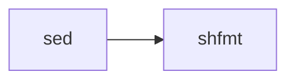

Shell scripts are formatted with **shfmt**, a parser and formatter for shell scripts that supports multiple dialects.

## shfmt

A modern shell script formatter with consistent, configurable output.

### Version

- **shfmt**: 3.10.0

### File Pattern Detection

shfmt uses intelligent file detection (entry.ts:379-423):

#### Extension-based

- `*.sh` - Shell scripts
- `*.bash` - Bash scripts
- `*.zsh` - Zsh scripts

#### Shebang-based

For files without extensions, checks the first line:

```typescript
if (/^#!.*\b(bash|sh|zsh)\b/.test(firstLine)) {
  return source;
}
```

Matches shebangs like:
- `#!/bin/bash`
- `#!/usr/bin/env sh`
- `#!/bin/zsh`

### Exclusions

Protobuf files are explicitly excluded even though they match the "text file" pattern:

```typescript
exclude: /\.proto$/
```

<Info>
  **Why exclude `.proto`?** Binary protobuf files might be misdetected as text, and removing trailing newlines could corrupt them.
</Info>

## Configuration

shfmt runs with specific style options:

```bash
/shfmt \
  -bn \
  -ci \
  -i=2 \
  -s \
  -sr \
  -w
```

### CLI Options

<Tabs>
  <Tab title="-bn (binary next line)">
    ```bash
    # With -bn (enabled)
    if [ condition ] \
      && [ other_condition ]; then
      echo "yes"
    fi
    
    # Without -bn
    if [ condition ] &&
      [ other_condition ]; then
      echo "yes"
    fi
    ```
    
    Binary operators (like `&&`, `||`, `|`) appear at the start of continuation lines.
  </Tab>
  <Tab title="-ci (case indent)">
    ```bash
    # With -ci (enabled)
    case $var in
      pattern1)
        echo "one"
        ;;
      pattern2)
        echo "two"
        ;;
    esac
    
    # Without -ci
    case $var in
    pattern1)
      echo "one"
      ;;
    pattern2)
      echo "two"
      ;;
    esac
    ```
    
    Indent case statement patterns.
  </Tab>
  <Tab title="-i=2 (indent 2)">
    Uses 2 spaces for indentation (matches most project conventions).
    
    ```bash
    if [ true ]; then
      echo "2 space indent"
      if [ true ]; then
        echo "nested"
      fi
    fi
    ```
  </Tab>
  <Tab title="-s (simplify)">
    Applies simplification rules:
    
    - Remove unnecessary quotes
    - Simplify conditional expressions
    - Merge adjacent string literals
    
    See [mvdan/sh simplification rules](https://github.com/mvdan/sh/blob/fa1b438/syntax/simplify.go#L13-L18)
  </Tab>
  <Tab title="-sr (space redirects)">
    ```bash
    # With -sr (enabled)
    echo "output" > file.txt
    cat < input.txt
    
    # Without -sr
    echo "output" >file.txt
    cat <input.txt
    ```
    
    Add space after redirect operators for readability.
  </Tab>
  <Tab title="-w (write)">
    Write formatted output back to files instead of stdout.
  </Tab>
</Tabs>

## Implementation

From entry.ts:379-429:

```typescript
[HookName.Shfmt]: {
  action: async sources => {
    // Find source files that are Shell files
    const shellSources = (
      await Promise.all(
        sources.map(async source => {
          // Check file extension
          if (source.split("/").slice(-1)[0].includes(".")) {
            return /\.(bash|sh|zsh)$/.test(source) ? source : undefined;
          }

          // Check shebang
          const firstLine = await new Promise<string>(resolve => {
            const reader = createInterface({
              input: createReadStream(source),
            });
            reader.on("line", line => {
              reader.close();
              resolve(line);
            });
          });
          if (/^#!.*\b(bash|sh|zsh)\b/.test(firstLine)) {
            return source;
          }
        }),
      )
    ).filter(isTruthy);
    if (!shellSources.length) {
      return;
    }

    await run("/shfmt", "-bn", "-ci", "-i=2", "-s", "-sr", "-w", ...shellSources);
  },
  exclude: /\.proto$/,
  include: /./,
  runAfter: [HookName.Sed],
},
```

## Execution Order

shfmt runs after `sed` transformations:



## Example Transformations

<Tabs>
  <Tab title="Indentation">
    ```bash
    # Before
    if [ "$1" = "test" ]; then
    echo "Testing"
    for i in 1 2 3; do
    echo $i
    done
    fi
    
    # After
    if [ "$1" = "test" ]; then
      echo "Testing"
      for i in 1 2 3; do
        echo $i
      done
    fi
    ```
  </Tab>
  <Tab title="Binary Operators">
    ```bash
    # Before
    if [ condition1 ] &&
       [ condition2 ] ||
       [ condition3 ]; then
      do_something
    fi
    
    # After (-bn flag)
    if [ condition1 ] \
      && [ condition2 ] \
      || [ condition3 ]; then
      do_something
    fi
    ```
  </Tab>
  <Tab title="Redirect Spacing">
    ```bash
    # Before
    cat<input.txt>output.txt 2>error.log
    
    # After (-sr flag)
    cat < input.txt > output.txt 2> error.log
    ```
  </Tab>
  <Tab title="Case Indentation">
    ```bash
    # Before
    case $option in
    start)
    echo "Starting"
    ;;
    stop)
    echo "Stopping"
    ;;
    *)
    echo "Unknown"
    ;;
    esac
    
    # After (-ci flag)
    case $option in
      start)
        echo "Starting"
        ;;
      stop)
        echo "Stopping"
        ;;
      *)
        echo "Unknown"
        ;;
    esac
    ```
  </Tab>
  <Tab title="Simplification">
    ```bash
    # Before
    [ "$var" = "" ]
    [[ $a = $b ]]
    echo "hello""world"
    
    # After (-s flag)
    [ -z "$var" ]
    [[ $a == $b ]]
    echo "helloworld"
    ```
  </Tab>
</Tabs>

## Binary Installation

shfmt is installed as a static binary (Dockerfile:97-98):

```dockerfile
wget https://github.com/mvdan/sh/releases/download/v3.10.0/shfmt_v3.10.0_linux_amd64 -O shfmt
chmod +x shfmt
```

<Info>
  Static binaries have no dependencies and are ideal for Docker containers.
</Info>

## Supported Dialects

shfmt can parse and format:

- **POSIX sh** - Portable shell scripts
- **Bash** - Bash-specific features
- **Zsh** - Zsh extensions (basic support)
- **mksh** - MirBSD Korn Shell (basic support)

The formatter automatically detects the dialect from the shebang or defaults to Bash.
