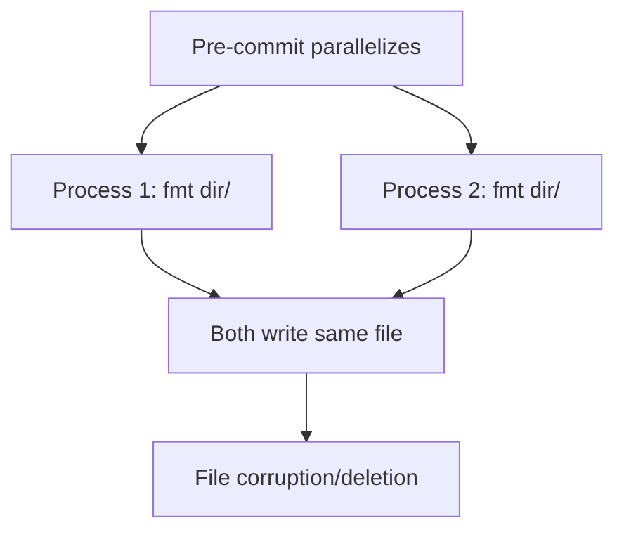
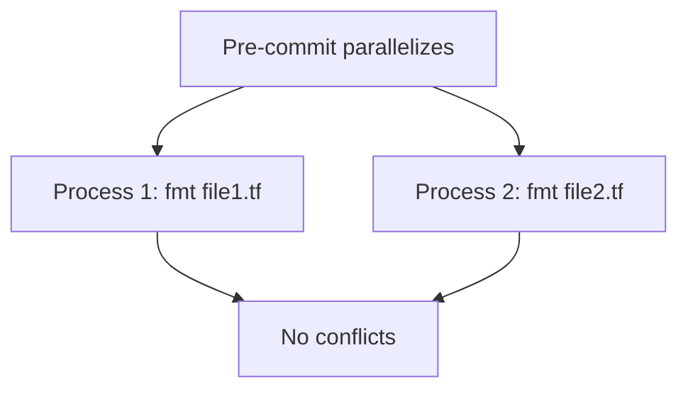

HashiCorp configuration files are formatted with their respective official formatters: **terraform fmt** and **packer fmt**.

## terraform fmt

The canonical formatter for Terraform configuration files.

### Version

- **Terraform**: 1.9.8

### File Pattern

- `*.tf` - Terraform configuration files

### Configuration

Terraform is invoked with write mode enabled:

```bash
/terraform fmt -write=true
```

### Per-file Processing

Unlike most formatters, terraform fmt processes files **one at a time** (entry.ts:455-471):

```typescript
action: sources =>
  Promise.all(
    sources.map(source => run("/terraform", "fmt", "-write=true", source)),
  ),
```

<Info>
  **Why process individually?** Officially, `terraform fmt` only accepts a directory argument. While it secretly supports individual files, processing them separately prevents race conditions when pre-commit parallelizes hooks across sibling files in the same directory.
</Info>

#### Race Condition Prevention

Without per-file processing:



With per-file processing:



### Execution Order

terraform fmt runs after `sed` transformations:


## packer fmt

The official formatter for Packer HCL template files.

### Version

- **Packer**: 1.14.2

### File Pattern

- `*.pkr.hcl` - Packer HCL2 template files

### Configuration

Packer fmt is invoked on source files directly:

```bash
/packer fmt
```

### Implementation

From entry.ts:249-253:

```typescript
[HookName.PackerFmt]: {
  action: sources => run("/packer", "fmt", ...sources),
  include: /\.pkr\.hcl$/,
  runAfter: [HookName.Sed],
},
```

<Note>
  Packer fmt can process multiple files in one invocation, unlike terraform fmt.
</Note>

### Execution Order

packer fmt runs after `sed` transformations:


## Installation

Both tools are installed as official HashiCorp binaries (Dockerfile:102-108):

```dockerfile
# Terraform
wget https://releases.hashicorp.com/terraform/1.9.8/terraform_1.9.8_linux_amd64.zip -O tf.zip
unzip tf.zip
rm tf.zip LICENSE.txt

# Packer
wget https://releases.hashicorp.com/packer/1.14.2/packer_1.14.2_linux_amd64.zip -O packer.zip
unzip packer.zip
rm packer.zip
```

## Example Transformations

<Tabs>
  <Tab title="Terraform - Indentation">
    ```hcl
    # Before
    resource "aws_instance" "example" {
    ami = "ami-123456"
    instance_type = "t2.micro"
    tags = {
    Name = "example"
    Environment = "production"
    }
    }
    
    # After
    resource "aws_instance" "example" {
      ami           = "ami-123456"
      instance_type = "t2.micro"
      tags = {
        Name        = "example"
        Environment = "production"
      }
    }
    ```
  </Tab>
  <Tab title="Terraform - Alignment">
    ```hcl
    # Before
    variable "region" {
    type = string
    default = "us-east-1"
    description = "AWS region"
    }
    
    # After
    variable "region" {
      type        = string
      default     = "us-east-1"
      description = "AWS region"
    }
    ```
    
    Attribute assignments are aligned for readability.
  </Tab>
  <Tab title="Terraform - Lists">
    ```hcl
    # Before
    security_groups = ["sg-1", "sg-2", "sg-3"]
    
    # After (if too long)
    security_groups = [
      "sg-1",
      "sg-2",
      "sg-3",
    ]
    ```
  </Tab>
  <Tab title="Packer - Basic Formatting">
    ```hcl
    # Before - example.pkr.hcl
    source "amazon-ebs" "example" {
    ami_name = "packer-example"
    instance_type = "t2.micro"
    region = "us-west-2"
    source_ami = "ami-123456"
    ssh_username = "ubuntu"
    }
    
    # After
    source "amazon-ebs" "example" {
      ami_name      = "packer-example"
      instance_type = "t2.micro"
      region        = "us-west-2"
      source_ami    = "ami-123456"
      ssh_username  = "ubuntu"
    }
    ```
  </Tab>
  <Tab title="Packer - Build Block">
    ```hcl
    # Before
    build {
    sources = ["source.amazon-ebs.example"]
    provisioner "shell" {
    inline = ["echo hello"]
    }
    }
    
    # After
    build {
      sources = ["source.amazon-ebs.example"]
      provisioner "shell" {
        inline = ["echo hello"]
      }
    }
    ```
  </Tab>
</Tabs>

## HCL Formatting Rules

Both formatters follow the same HCL style guide:

### Indentation
- 2 spaces per level
- No tabs

### Alignment
- Attribute assignments aligned within blocks
- Only when it improves readability

### Spacing
- Blank line between top-level blocks
- No blank lines within blocks (unless separating logical sections)

### Comments
- `#` for single-line comments
- `/* */` for multi-line comments
- Preserved and properly indented

## File Pattern Notes

### Terraform

✅ Formatted:
- `main.tf`
- `variables.tf`
- `outputs.tf`

❌ Not formatted:
- `*.tfvars` - Variable value files (not HCL config)
- `*.tf.json` - JSON variant (different formatter needed)

### Packer

✅ Formatted:
- `*.pkr.hcl` - HCL2 templates

❌ Not formatted:
- `*.json` - Legacy JSON templates
- `*.pkrvars.hcl` - Variable files (though they would format correctly)

<Warning>
  Old Packer JSON templates (without `.pkr.hcl` extension) are not formatted. Consider migrating to HCL2 format.
</Warning>
